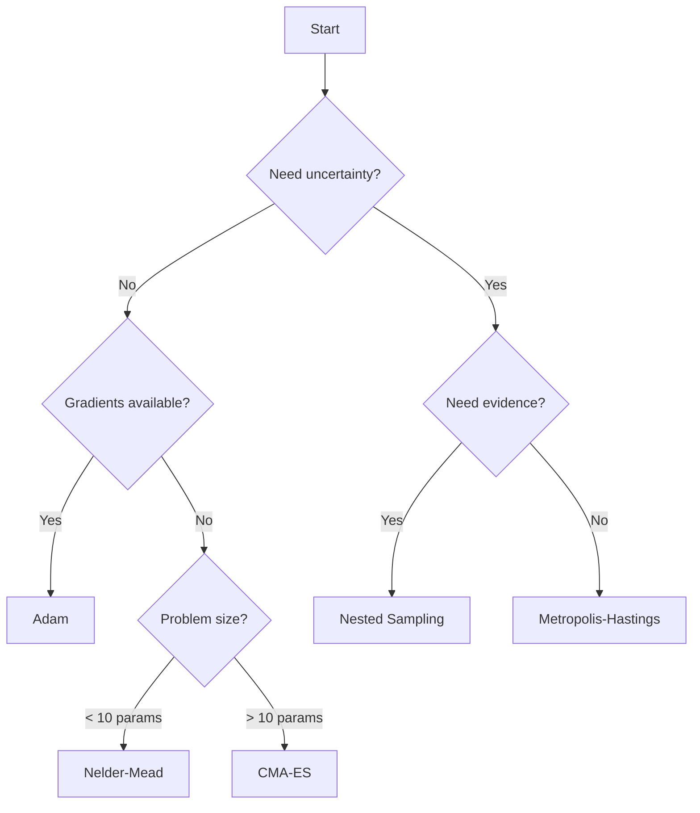

# Algorithms

Detailed documentation for each optimisation and sampling algorithm in Diffid.

## Optimisers

Gradient-free and gradient-based algorithms for finding optimal parameters.

-   :material-triangle:{ .lg .middle } __Nelder-Mead__

    ---

    Simplex-based gradient-free optimiser for local search.

    [:octicons-arrow-right-24: Details](optimizers/nelder-mead.md)

-   :material-chart-scatter-plot:{ .lg .middle } __CMA-ES__

    ---

    Covariance Matrix Adaptation Evolution Strategy for global optimisation.

    [:octicons-arrow-right-24: Details](optimizers/cmaes.md)

-   :material-alpha-a:{ .lg .middle } __Adam__

    ---

    Adaptive Moment Estimation for gradient-based optimisation.

    [:octicons-arrow-right-24: Details](optimizers/adam.md)

## Samplers

MCMC and nested sampling for uncertainty quantification and model comparison.

-   :material-chart-timeline-variant:{ .lg .middle } __Metropolis-Hastings__

    ---

    MCMC sampling for posterior exploration.

    [:octicons-arrow-right-24: Details](samplers/metropolis-hastings.md)

-   :material-layers-triple:{ .lg .middle } __Dynamic Nested Sampling__

    ---

    Evidence calculation for Bayesian model comparison.

    [:octicons-arrow-right-24: Details](samplers/dynamic-nested-sampling.md)

## Algorithm Comparison

| Algorithm | Type | Gradients | Best For | Parallelisable |
|-----------|------|-----------|----------|----------------|
| Nelder-Mead | Local | No | < 10 params, noisy | No |
| CMA-ES | Global | No | 10-100+ params | Yes |
| Adam | Local | Yes | Smooth objectives | No |
| Metropolis-Hastings | MCMC | No | Uncertainty | No |
| Nested Sampling | Evidence | No | Model comparison | Yes |

## Choosing an Algorithm

## Performance Characteristics

### Convergence Speed

Fast → Slow:

1. **Adam** (with gradients)
2. **Nelder-Mead** (small problems)
3. **CMA-ES** (large problems)
4. **MCMC samplers** (many evaluations)
5. **Nested sampling** (most evaluations)

### Robustness to Local Minima

Least → Most robust:

1. **Adam** (gradient descent)
2. **Nelder-Mead** (local search)
3. **CMA-ES** (global search)
4. **MCMC** (explores posterior)
5. **Nested sampling** (explores full space)

## Implementation Details

All algorithms are implemented in Rust for performance:

- **Zero-copy**: Efficient memory usage
- **Parallel**: Where applicable (CMA-ES, nested sampling)
- **Numerically stable**: Careful floating-point handling
- **Well-tested**: Comprehensive test suite

Source code: [rust/src/optimisers/](https://github.com/bradyplanden/diffid/tree/main/rust/src/optimisers)

## References

Each algorithm page includes references to original papers and implementation details.

## See Also

- [Choosing an Optimiser](../guides/choosing-optimiser.md)
- [Tuning Optimisers](../guides/tuning-optimizers.md)
- [API Reference](../api-reference/index.md)
- [Tutorials](../tutorials/index.md)
