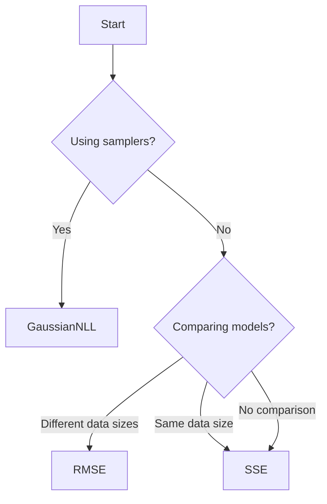

# Cost Metrics

Cost metrics define how model predictions are compared to observations. They determine the objective function that optimisers minimise.

## Overview

| Metric | Formula | Use Case |
|--------|---------|----------|
| `SSE` | $\sum (y_i - \hat{y}_i)^2$ | Standard least squares |
| `RMSE` | $\sqrt{\frac{1}{n}\sum (y_i - \hat{y}_i)^2}$ | Normalised error |
| `GaussianNLL` | $-\log p(data \mid params)$ | Bayesian inference |

## CostMetric

::: chronopt.CostMetric
    options:
      show_root_heading: true
      show_source: false

---

## SSE (Sum of Squared Errors)

The default cost metric. Minimises the sum of squared residuals.

$$\text{SSE} = \sum_{i=1}^{n} (y_i - \hat{y}_i)^2$$

### Example Usage

```python
import chronopt as chron

builder = (
    chron.DiffsolBuilder()
    .with_diffsl(dsl)
    .with_data(data)
    .with_parameter("k", 1.0)
    # SSE is used by default, but can be explicit:
    # .with_cost_metric(chron.SSE())
)
```

### When to Use

**Advantages:**

- Standard least squares approach
- Well-understood statistical properties
- Efficient to compute

**Limitations:**

- Not normalised (sensitive to number of data points)
- Sensitive to outliers (squared errors magnify them)
- Assumes Gaussian errors with constant variance

**Typical Use Cases:**

- Standard parameter fitting
- When absolute error scale matters
- Comparing models with same number of points

---

## RMSE (Root Mean Squared Error)

Normalised version of SSE. Divides by number of points and takes square root.

$$\text{RMSE} = \sqrt{\frac{1}{n} \sum_{i=1}^{n} (y_i - \hat{y}_i)^2}$$

### Example Usage

```python
import chronopt as chron

builder = (
    chron.DiffsolBuilder()
    .with_diffsl(dsl)
    .with_data(data)
    .with_parameter("k", 1.0)
    .with_cost_metric(chron.RMSE())
)
```

### When to Use

**Advantages:**

- Normalised (independent of data size)
- Same units as observations
- Better for comparing models with different data sizes

**Limitations:**

- Still sensitive to outliers
- Assumes Gaussian errors

**Typical Use Cases:**

- Comparing models with different numbers of observations
- Reporting error in interpretable units
- Cross-validation and model selection

---

## GaussianNLL (Gaussian Negative Log-Likelihood)

Probabilistic cost metric for Bayesian inference. Assumes Gaussian observation noise.

$$\text{GaussianNLL} = -\log p(data \mid params) = \frac{n}{2}\log(2\pi\sigma^2) + \frac{1}{2\sigma^2}\sum_{i=1}^{n} (y_i - \hat{y}_i)^2$$

where $\sigma^2$ is estimated from residuals.

### Example Usage

```python
import chronopt as chron

builder = (
    chron.DiffsolBuilder()
    .with_diffsl(dsl)
    .with_data(data)
    .with_parameter("k", 1.0)
    .with_cost_metric(chron.GaussianNLL())
)

# Use with MCMC sampling for Bayesian inference
sampler = chron.MetropolisHastings().with_max_iter(10000)
result = sampler.run(problem, initial_guess)
```

### When to Use

**Advantages:**

- Proper probabilistic interpretation
- Required for Bayesian inference (MCMC, nested sampling)
- Automatically accounts for noise level
- Enables uncertainty quantification

**Limitations:**

- Assumes Gaussian observation noise
- More computationally expensive than SSE
- Requires understanding of likelihood

**Typical Use Cases:**

- MCMC sampling for uncertainty quantification
- Model comparison with Bayes factors
- When probabilistic interpretation is needed
- Nested sampling for evidence calculation

---

## Choosing a Cost Metric



### Decision Guide

**Use SSE when:**

- Standard least squares fitting
- Single model, fixed data
- Speed is critical

**Use RMSE when:**

- Comparing models with different data sizes
- Want interpretable error in original units
- Cross-validation or model selection

**Use GaussianNLL when:**

- MCMC sampling (Metropolis-Hastings)
- Nested sampling (model evidence)
- Need confidence intervals
- Bayesian inference required

For more details, see the [Cost Metrics Guide](../../guides/cost-metrics.md).

---

## Custom Cost Metrics

Currently, custom cost metrics must be implemented in Rust. Python-level custom metrics are planned for a future release.

To implement a custom cost metric:

1. Add implementation in `rust/src/cost/`
2. Expose through Python bindings
3. Rebuild the package

See the [Development Guide](../../development/architecture.md) for details on extending Chronopt.

---

## Mathematical Background

### Relationship to Maximum Likelihood

Minimising SSE is equivalent to maximum likelihood estimation under Gaussian noise with known variance:

$$\hat{\theta} = \arg\min_\theta \sum (y_i - f(x_i; \theta))^2 = \arg\max_\theta p(data \mid \theta)$$

### Weighted Least Squares

For heteroscedastic data (varying noise), weighted metrics can be important. Contact the developers if you need this feature.

---

## See Also

- [Cost Metrics Guide](../../guides/cost-metrics.md)
- [Builders](builders.md)
- [Samplers](samplers.md) (for Bayesian inference)
- [Parameter Uncertainty Tutorial](../../tutorials/notebooks/03_parameter_uncertainty.ipynb)
