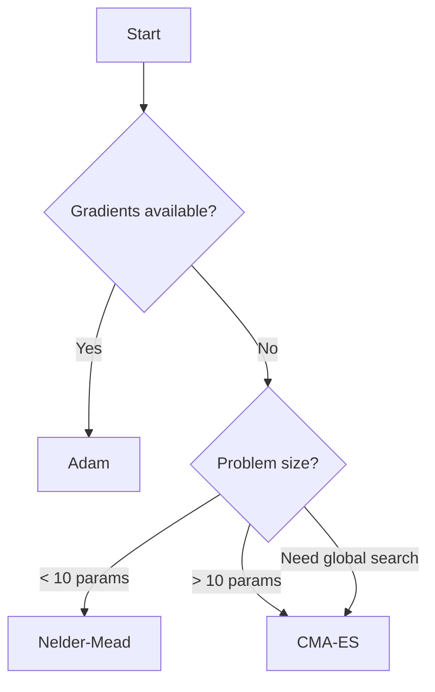

# Optimisers

Optimisation algorithms for finding parameter values that minimise the objective function.

## Overview

| Optimiser | Type | Best For | Parameters |
|-----------|------|----------|------------|
| `NelderMead` | Gradient-free | Local search, < 10 params, noisy | 2-10 |
| `CMAES` | Gradient-free | Global search, 10-100+ params | 1-100+ |
| `Adam` | Gradient-based | Smooth objectives, fast convergence | Any |

## Nelder-Mead

::: diffid.NelderMead
    options:
      show_root_heading: true
      show_source: false

### Example Usage

```python
import diffid as chron

# Create optimiser with custom settings
optimiser = (
    diffid.NelderMead()
    .with_max_iter(5000)
    .with_step_size(0.1)
    .with_threshold(1e-6)
)

# Run optimisation
result = optimiser.run(problem, initial_guess=[1.0, 2.0])
```

### When to Use

**Advantages:**

- No gradient computation required
- Robust to noisy objectives
- Simple and reliable for small problems
- Default choice for quick exploration

**Limitations:**

- Slow convergence for > 10 parameters
- Can get stuck in local minima
- Performance degrades with dimensionality

**Typical Use Cases:**

- Initial parameter exploration
- Noisy experimental data
- Small-scale problems (< 10 parameters)

### Parameter Tuning

- **`step_size`**: Initial simplex size (default: 1.0)
    - Larger values explore more globally
    - Smaller values for local refinement
    - Start with 10-50% of parameter range

- **`threshold`**: Convergence tolerance (default: 1e-6)
    - Smaller for higher precision
    - Larger for faster termination

- **`max_iter`**: Maximum iterations (default: 1000)
    - Rule of thumb: `100 * n_parameters` minimum

See the [Nelder-Mead Algorithm Guide](../../algorithms/optimizers/nelder-mead.md) for more details.

---

## CMA-ES

::: diffid.CMAES
    options:
      show_root_heading: true
      show_source: false

### Example Usage

```python
import diffid as chron

# Create CMA-ES optimiser
optimiser = (
    diffid.CMAES()
    .with_max_iter(1000)
    .with_step_size(0.5)
    .with_population_size(20)
    .with_seed(42)  # For reproducibility
)

result = optimiser.run(problem, initial_guess=[0.5, 0.5])
```

### When to Use

**Advantages:**

- Global optimisation (avoids local minima)
- Scales to high dimensions (10-100+ parameters)
- Parallelisable (evaluates population in parallel)
- Self-adapting (no gradient tuning needed)

**Limitations:**

- More function evaluations than gradient methods
- Requires population-sized memory
- Stochastic (results vary between runs)

**Typical Use Cases:**

- Global parameter search
- High-dimensional problems (> 10 parameters)
- Multi-modal landscapes
- Parallel hardware available

### Parameter Tuning

- **`step_size`**: Initial search radius (default: 1.0)
    - Start with ~1/3 of expected parameter range
    - Too large: slow convergence
    - Too small: premature convergence

- **`population_size`**: Offspring per generation (default: `4 + floor(3*ln(n_params))`)
    - Larger populations explore more but cost more
    - Typical range: 10-100
    - Must match available parallelism

- **`max_iter`**: Maximum generations (default: 1000)
    - Each iteration evaluates `population_size` candidates
    - Total evaluations = `max_iter * population_size`

- **`threshold`**: Objective value threshold (default: 1e-6)
    - Stop when best value < threshold

- **`seed`**: Random seed for reproducibility
    - Omit for non-deterministic runs
    - Set for reproducible benchmarks

See the [CMA-ES Algorithm Guide](../../algorithms/optimizers/cmaes.md) for more details.

---

## Adam

::: diffid.Adam
    options:
      show_root_heading: true
      show_source: false

### Example Usage

```python
import diffid as chron

# Create Adam optimiser
optimiser = (
    diffid.Adam()
    .with_max_iter(5000)
    .with_step_size(0.01)  # Learning rate
    .with_betas(0.9, 0.999)
    .with_threshold(1e-6)
)

result = optimiser.run(problem, initial_guess=[1.0, 2.0])
```

### When to Use

**Advantages:**

- Fast convergence on smooth objectives
- Adaptive learning rate
- Well-suited for large-scale problems
- Efficient (uses gradients)

**Limitations:**

- Requires automatic differentiation
- Can get stuck in local minima
- Sensitive to learning rate tuning

**Typical Use Cases:**

- Smooth, differentiable objectives
- Large-scale problems
- When gradients are available or cheap to compute

### Parameter Tuning

- **`step_size`**: Learning rate (default: 0.001)
    - Most critical parameter
    - Too large: oscillation or divergence
    - Too small: slow convergence
    - Try: 0.1, 0.01, 0.001, 0.0001

- **`betas`**: Momentum decay rates (default: (0.9, 0.999))
    - `beta1`: First moment (mean) decay
    - `beta2`: Second moment (variance) decay
    - Rarely need tuning, defaults work well

- **`eps`**: Numerical stability constant (default: 1e-8)
    - Prevents division by zero
    - Almost never needs tuning

- **`threshold`**: Gradient norm threshold (default: 1e-6)
    - Stop when gradient is small
    - Smaller for higher precision

See the [Adam Algorithm Guide](../../algorithms/optimizers/adam.md) for more details.

---

## Common Patterns

### Running Optimisation

All optimisers have a `.run()` method:

```python
result = optimiser.run(problem, initial_guess)
```

For the default optimiser (Nelder-Mead):

```python
result = problem.optimise()  # Uses Nelder-Mead with defaults
```

### Configuring Stopping Criteria

```python
optimiser = (
    diffid.CMAES()
    .with_max_iter(10000)         # Maximum iterations
    .with_threshold(1e-8)         # Objective threshold
    .with_patience(300.0)         # Patience in seconds
)
```

The optimiser stops when:
1. `max_iter` iterations reached, OR
2. Objective value < `threshold`, OR
3. `patience` seconds elapsed without improvement

### Reproducibility

For stochastic optimisers (CMA-ES), set a seed:

```python
optimiser = diffid.CMAES().with_seed(42)
result1 = optimiser.run(problem, [0.0, 0.0])
result2 = optimiser.run(problem, [0.0, 0.0])
# result1 == result2 (same random sequence)
```

### Warm Starts

Run multiple optimisations with different starting points:

```python
import numpy as np

initial_guesses = [
    [1.0, 1.0],
    [-1.0, -1.0],
    [0.0, 2.0],
]

results = [optimiser.run(problem, guess) for guess in initial_guesses]
best_result = min(results, key=lambda r: r.value)
```

## Choosing an Optimiser



For detailed guidance, see:
- [Choosing an Optimiser Guide](../../guides/choosing-optimiser.md)
- [Tuning Optimisers Guide](../../guides/tuning-optimizers.md)

## See Also

- [Algorithm Guides](../../algorithms/index.md)
- [Results](results.md)
- [Tutorials](../../tutorials/index.md)
