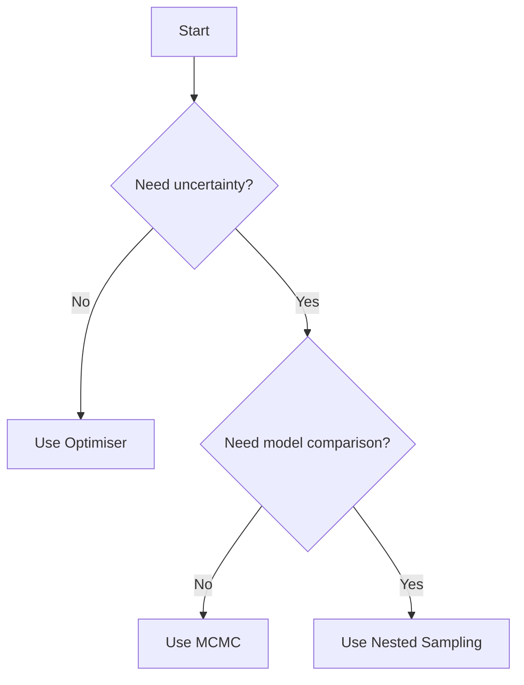

# Samplers

MCMC and nested sampling algorithms for posterior exploration and model comparison.

## Overview

| Sampler | Type | Use Case |
|---------|------|----------|
| `MetropolisHastings` | MCMC | Posterior exploration, uncertainty quantification |
| `DynamicNestedSampling` | Nested | Model evidence, Bayes factors |

Samplers complement optimisers by providing full posterior distributions rather than point estimates.

---

## Metropolis-Hastings

MCMC sampling for exploring parameter posterior distributions.

```python
import diffid as chron

# Will be available in a future release
sampler = (
    diffid.MetropolisHastings()
    .with_max_iter(10000)
    .with_step_size(0.1)
    .with_burn_in(1000)
    .with_seed(42)
)

result = sampler.run(problem, initial_guess)

# Access samples
print(result.samples.shape)  # (n_samples, n_params)
print(result.acceptance_rate)  # Target: 0.2-0.4
```

### When to Use

**Advantages:**

- Provides full posterior distribution
- Quantifies parameter uncertainty
- Captures correlations between parameters
- Enables credible intervals

**Limitations:**

- Requires many function evaluations
- Need to assess convergence
- Requires likelihood (GaussianNLL cost metric)

**Typical Use Cases:**

- Uncertainty quantification
- Confidence intervals
- Posterior predictive distributions
- Parameter correlations

---

## Dynamic Nested Sampling

Nested sampling for calculating model evidence (marginal likelihood) for model comparison.

```python
import diffid as chron

# Will be available in a future release
sampler = (
    diffid.DynamicNestedSampling()
    .with_max_iter(5000)
    .with_n_live_points(500)
    .with_seed(42)
)

result = sampler.run(problem, initial_guess)

# Access evidence
print(f"Log evidence: {result.log_evidence:.2f}")
print(f"Error: {result.evidence_error:.2f}")

# Posterior samples also available
print(result.samples.shape)
```

### When to Use

**Advantages:**

- Calculates marginal likelihood (evidence)
- Enables model comparison via Bayes factors
- Provides posterior samples as byproduct
- Efficient for multi-modal posteriors

**Limitations:**

- More expensive than MCMC
- Requires careful tuning of live points
- Needs likelihood (GaussianNLL cost metric)

**Typical Use Cases:**

- Model comparison
- Bayes factors
- Evidence calculation
- Multi-modal posteriors

---

## Optimisers vs Samplers

| | Optimisers | Samplers |
|---|------------|----------|
| **Output** | Single best parameters | Distribution of parameters |
| **Use case** | Point estimate | Uncertainty quantification |
| **Cost metric** | SSE, RMSE, GaussianNLL | GaussianNLL (required) |
| **Computational cost** | Lower | Higher |
| **Uncertainty** | None | Full posterior |

### When to Use Which



---

## Cost Metric Requirement

!!! warning
    Samplers require a probabilistic cost metric (typically `GaussianNLL`):

```python
# Required for samplers
builder = (
    diffid.DiffsolBuilder()
    .with_diffsl(dsl)
    .with_data(data)
    .with_parameter("k", 1.0)
    .with_cost_metric(diffid.GaussianNLL())  # Required!
)
```

SSE and RMSE cannot be used with samplers as they lack probabilistic interpretation.

---

## Workflow Example

Typical workflow: optimise first, then sample for uncertainty:

```python
import diffid as chron

# 1. Build problem with GaussianNLL
builder = (
    diffid.DiffsolBuilder()
    .with_diffsl(dsl)
    .with_data(data)
    .with_parameter("k", 1.0)
    .with_cost_metric(diffid.GaussianNLL())
)
problem = builder.build()

# 2. Find MAP estimate with optimiser
optimiser = diffid.CMAES().with_max_iter(1000)
opt_result = optimiser.run(problem, [1.0])

print(f"MAP estimate: {opt_result.x}")

# 3. Sample around MAP for uncertainty (future API)
# sampler = diffid.MetropolisHastings().with_max_iter(10000)
# sample_result = sampler.run(problem, opt_result.x)
# print(f"Posterior mean: {sample_result.samples.mean(axis=0)}")
# print(f"Posterior std: {sample_result.samples.std(axis=0)}")
```

---

## Tutorials

The followings present sampler functionality:

- [Parameter Uncertainty Tutorial](../../tutorials/notebooks/parameter_uncertainty.ipynb)
- [Model Comparison Tutorial](../../tutorials/notebooks/model_comparison.ipynb)
- [Choosing a Sampler Guide](../../guides/choosing-sampler.md)

---

## See Also

- [Optimisers](optimisers.md) - For point estimates
- [Cost Metrics](cost-metrics.md) - GaussianNLL required
- [Choosing a Sampler Guide](../../guides/choosing-sampler.md) (future)
- [Algorithm Guides](../../algorithms/index.md)
