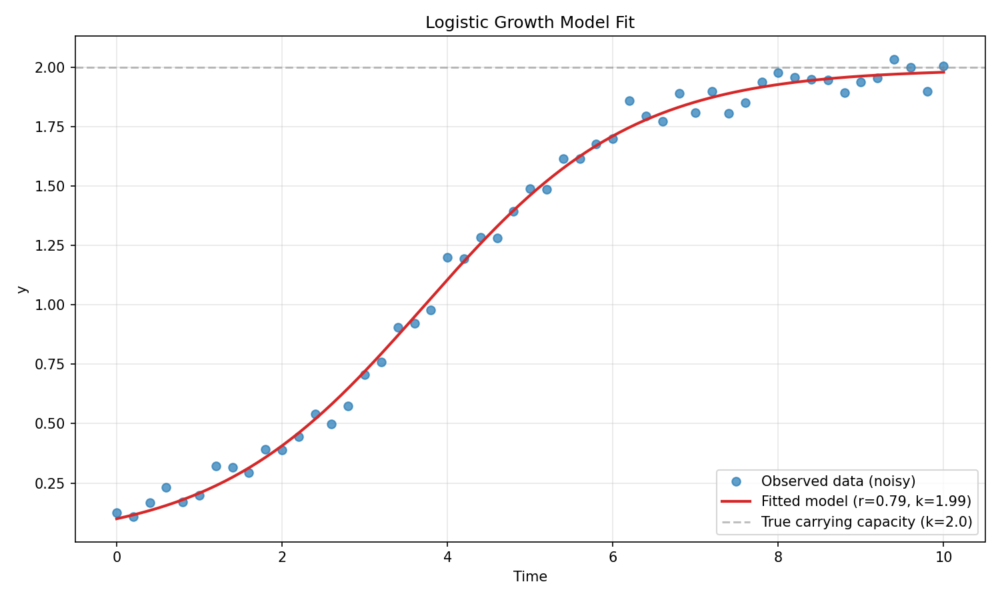

# First ODE Fit

This tutorial demonstrates how to fit ordinary differential equations (ODEs) to data using Diffid's DiffSL integration with the Diffsol solver.

## The Problem: Logistic Growth

We'll fit a logistic growth model to synthetic population data. The logistic growth equation is:

$$\frac{dy}{dt} = r \cdot y \cdot \left(1 - \frac{y}{k}\right)$$

where: $r$ is the growth rate, $k$ is the carrying capacity, and $y$ is the population.

## Complete Example

```python
import numpy as np
import diffid as chron

# Define the ODE model in DiffSL syntax
dsl = """
in_i { r = 1, k = 1 }
u_i { y = 0.1 }
F_i { (r * y) * (1 - (y / k)) }
"""

# Generate synthetic data from the logistic model with noise
from scipy.integrate import odeint

def logistic(y, t, r, k):
    return r * y * (1 - y / k)

t = np.linspace(0.0, 10.0, 51)
y_true = odeint(logistic, 0.1, t, args=(0.8, 2.0)).flatten()  # True: r=0.8, k=2.0
np.random.seed(42)
observations = y_true + 0.05 * np.random.randn(len(t))
data = np.column_stack((t, observations))

# Build the problem
builder = (
    diffid.DiffsolBuilder()
    .with_diffsl(dsl)
    .with_data(data)
    .with_parameter("r", 0.5)  # Initial guess for growth rate
    .with_parameter("k", 1.0)  # Initial guess for carrying capacity
    .with_backend("dense")
)
problem = builder.build()

# Run optimisation with CMA-ES
optimiser = diffid.CMAES().with_max_iter(1000)
result = optimiser.run(problem, [0.5, 1.0])

# Display results
print(f"Fitted parameters:")
print(f"  r (growth rate) = {result.x[0]:.4f}")
print(f"  k (capacity) = {result.x[1]:.4f}")
print(f"Objective value: {result.value:.3e}")
print(f"Success: {result.success}")
```

## Understanding DiffSL Syntax

DiffSL is a domain-specific language for defining differential equations. Let's break down the syntax:

```
in_i { r = 1, k = 1 }            # Input parameter tensor with defaults
u_i { y = 0.1 }                  # Initial conditions
F_i { (r * y) * (1 - (y / k)) }  # Right-hand side of dy/dt = ...
```

## Data Format

Diffid expects data as a 2D NumPy array where:

- **First column**: Time points
- **Remaining columns**: Observed values for each variable

```python
# Example: 51 time points, 1 state variable
t = np.linspace(0.0, 10.0, 51)
observations = ...  # Your observed data
data = np.column_stack((t, observations))  # Shape: (51, 2)
```

For multi-variable systems:

```python
# Example: 2 state variables
data = np.column_stack((t, obs_var1, obs_var2))  # Shape: (n, 3)
```

## Visualising Results

```python
import matplotlib.pyplot as plt

# Generate fitted curve using optimised parameters
t_dense = np.linspace(0.0, 10.0, 200)
y_fitted = odeint(logistic, 0.1, t_dense, args=(result.x[0], result.x[1])).flatten()

# Plot
plt.figure(figsize=(10, 6))
plt.plot(data[:, 0], data[:, 1], 'o', label='Observed data', alpha=0.6)
plt.plot(t_dense, y_fitted, '-', label='Fitted model', linewidth=2)
plt.xlabel('Time')
plt.ylabel('y')
plt.title('Logistic Growth Model Fit')
plt.legend()
plt.grid(True, alpha=0.3)
plt.show()
```



## Common ODE Patterns

### Multiple State Variables

```python
dsl = """
in_i { alpha = 1, beta = 1 }
u_i {
    x = 1.0
    y = 0.5
}
F_i {
    alpha * x - beta * x * y,
    -beta * y + alpha * x * y
}
out_i { x, y }
"""
```

### With Algebraic Variables

```python
dsl = """
in_i {k1 = 1, k2 = 1 }
u_i { A = 1.0 }
dudt_i { -k1 * A }
F_i {
    -k1 * A,
    k1 * A - k2 * B
}
out_i { A, B }
"""
```

### Time-Dependent Forcing

```python
dsl = """
in_i { k = 1 }
u_i { y = 0.0 }
F_i { k * sin(t) - y }
"""
```

## Cost Metrics

By default, Diffid uses sum of squared errors (SSE). You can specify different cost metrics as shown below. See the [Cost Metrics Guide](../guides/cost-metrics.md) for more details.

```python
from diffid import GaussianNLL, RMSE

# Use Gaussian negative log-likelihood
builder = (
    diffid.DiffsolBuilder()
    .with_diffsl(dsl)
    .with_data(data)
    .with_parameter("k", 1.0)
    .with_cost_metric(GaussianNLL())  # For probabilistic inference
)

# Or use root mean squared error
builder = builder.with_cost_metric(RMSE())  # Normalised by number of points
```

## Optimiser Selection

Different optimisers work better for different problems. For a detailed comparison, see [Choosing an Optimiser](../guides/choosing-optimiser.md).

### Nelder-Mead (Default)

```python
result = problem.optimise()  # Uses Nelder-Mead
```

**Best for**: Small problems (< 10 parameters), noisy objectives

### CMA-ES

```python
optimiser = diffid.CMAES().with_max_iter(1000).with_step_size(0.5)
result = optimiser.run(problem, initial_guess)
```

**Best for**: Global optimisation, 10-100 parameters, parallelisable

### Adam

```python
optimiser = diffid.Adam().with_max_iter(1000).with_step_size(0.01)
result = optimiser.run(problem, initial_guess)
```

**Best for**: Smooth problems, fast convergence on well-behaved objectives

## Troubleshooting

### Poor Fit Quality

1. **Check initial conditions**: Ensure they're physically reasonable
2. **Try different optimisers**: CMA-ES is often more robust than Nelder-Mead
3. **Increase iterations**: Use `.with_max_iter(10000)`
4. **Check data scale**: Normalise data if variables have very different magnitudes

### Solver Errors

1. **Stiff equations**: Try changing the solver tolerance
2. **Numerical instability**: Check for divide-by-zero or exp overflow in your ODE
3. **Backend mismatch**: Try switching between `dense` and `sparse`

For more help, see the [Troubleshooting Guide](../guides/troubleshooting.md).

## Next Steps

- **[Core Concepts](concepts.md)**: Understand builders, problems, and the ask/tell pattern
- **[ODE Fitting Tutorial](../tutorials/notebooks/ode_fitting_diffsol.ipynb)**: Interactive notebook with more examples
- **[Custom Solvers](../guides/custom-solvers.md)**: Integrate Diffrax or DifferentialEquations.jl
- **[Parameter Uncertainty](../tutorials/notebooks/parameter_uncertainty.ipynb)**: Use MCMC sampling to quantify uncertainty
