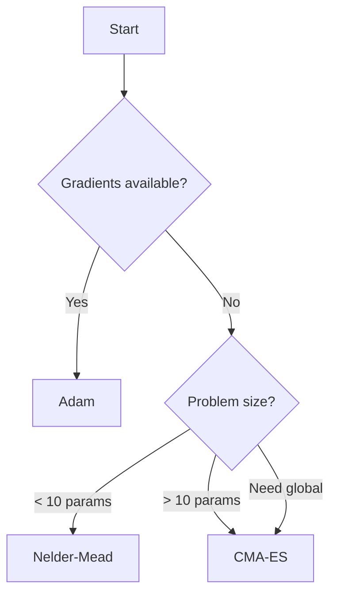

# Choosing an Optimiser

!!! info "Coming Soon"
    This guide is being written. Check back soon for detailed optimiser selection guidance.

## Quick Reference

| Problem Characteristics | Recommended Optimiser |
|-------------------------|----------------------|
| < 10 parameters, noisy | Nelder-Mead |
| 10-100+ parameters | CMA-ES |
| Smooth, gradients available | Adam |
| Need global search | CMA-ES |
| Fast local refinement | Nelder-Mead |

## Decision Tree

## See Also

- [Optimisers API](../api-reference/python/optimisers.md)
- [Tuning Optimisers](tuning-optimisers.md)
- [Algorithm Details](../algorithms/index.md)
